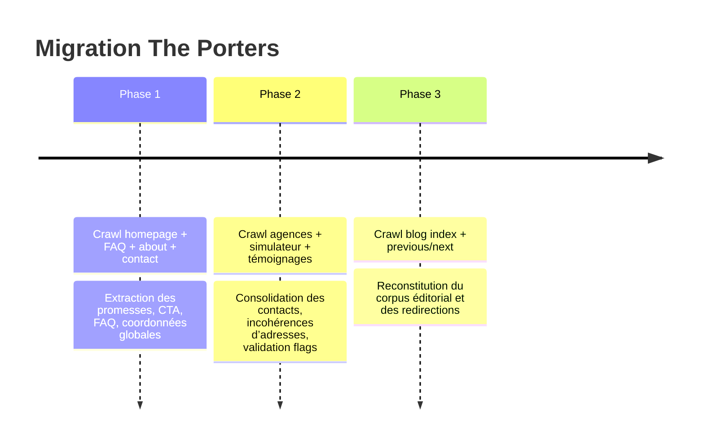

# Pack d’implémentation de migration contenu The Porters

## Synthèse exécutive

Le site public `porters.fr` fournit déjà une base solide pour la migration vers le nouvel Astro site : la homepage contient un hero à 3 témoignages, le bloc process “L’atelier du Portage Salarial”, un CTA simulateur, une section témoignages avec le chiffre “97% de collaborateurs satisfaits” et un aperçu blog ; la FAQ apporte les réponses juridiques et opérationnelles les plus utiles ; la page “Qui sommes-nous ?” documente l’ancienneté de la société, son adhésion FEPS, sa présence territoriale et ses services en ligne ; enfin, la navigation expose six pages agences publiques. citeturn0view0turn7view0turn1view2turn2view0turn2view1turn2view2turn2view3turn2view4turn2view5

Deux réserves structurantes ressortent du crawl. D’abord, certaines promesses sont présentes mais doivent être validées avant republication : paiement “entre le 1er et le 5 du mois suivant”, avance de salaire, transparence sur les frais, chiffre de satisfaction à 97%, promesse de présence “nationale”. Ensuite, plusieurs pages publiques sont incohérentes ou incomplètes : Paris affiche deux adresses différentes selon la zone consultée, Montpellier a un titre Strasbourg et un body qui parle du Grand Est, Marseille/Bordeaux/Lille partagent le même contact sans adresse locale visible, et aucune page Toulouse n’apparaît dans la navigation crawlée. citeturn7view0turn23view0turn0view0turn1view2turn2view0turn4view1turn4view4turn4view5turn4view6turn4view8

Le blog visible sur l’index ne montre que 8 articles, mais la navigation “previous/next post” révèle un historique éditorial plus large, avec au moins 11 autres pages remontant jusqu’en 2019, dont plusieurs contenus IT très utiles pour repositionner la nouvelle homepage et les futures pages métiers. Il ne faut donc pas migrer “le blog index seulement”, mais bien l’ensemble des URL retrouvées pendant le crawl. citeturn1view4turn9view0turn10view0turn11view0turn12view0turn13view0turn14view0turn14view1turn21view0turn22view0turn22view1turn23view0turn24view0

## Périmètre et méthode

Source unique utilisée : les pages publiques crawlées de `porters.fr` accessibles depuis la navigation, la homepage, la FAQ, la page “Qui sommes-nous ?”, la page contact, le simulateur public, les pages agences et les articles atteints depuis l’index blog puis via les liens “previous/next post”. citeturn0view0turn1view2turn1view3turn7view0turn17view0turn2view0turn2view1turn2view2turn2view3turn2view4turn2view5turn1view4turn24view0



Les blocs ci-dessous sont prêts à coller dans le projet. Les longs verbatims du site ont été condensés en résumés opérationnels lorsque cela évite de reproduire de longs passages source ; chaque entrée conserve un `sourceUrl` pour vérification rapide dans le code. Les titres courts, labels de sections, questions FAQ et libellés visibles ont été conservés lorsqu’ils sont brefs et fonctionnels. citeturn0view0turn7view0turn1view2turn1view4

## Homepage et différenciation prêtes à coller

Le bloc ci-dessous synthétise la homepage actuelle, la FAQ, la page “Qui sommes-nous ?”, le simulateur public et les contenus IT trouvés dans les articles “Les secteurs…”, “Portage salarial informatique…”, “Devenir freelance informatique…” et “Consultant informatique indépendant…”. Il est réécrit pour être plus propre dans le nouveau thème tout en restant strictement ancré dans le site source. citeturn0view0turn1view2turn7view0turn17view0turn20view0turn21view0turn14view1turn13view0

```ts
// src/data/homepage.data.ts

export const homepageContent = {
  hero: {
    title: "Exercez en indépendant avec la sécurité du salariat",
    subtitle:
      "The Porters vous permet de développer votre activité, de choisir vos missions et de conserver les avantages du statut de salarié, tout en déléguant la gestion administrative.",
    primaryCtaLabel: "Simuler mes revenus",
    primaryCtaHref: "/simulateur",
    secondaryCtaLabel: "Parler à un chargé d’affaires",
    secondaryCtaHref: "TODO_CONFIRM_BOOKING_ROUTE",
    sourceUrl: "https://www.porters.fr/",
    notes:
      "Le hero actuel renvoie le CTA RDV vers /contactez-nous/ ; des liens distincts vers /prendre-rdv-avec-un-charge-d-affaires/ et /reunion-d-information/ existent aussi sur le site et doivent être arbitrés avant mise en ligne."
  },

  consultantsIt: {
    eyebrow: "Profils accompagnés",
    title: "Un portage salarial pensé pour les consultants IT",
    intro:
      "Le site source associe explicitement le portage salarial aux métiers de l’informatique, du digital, du conseil et de l’expertise. Les articles historiques ciblent notamment les consultants informatiques, les développeurs, les ingénieurs, les formateurs et les profils web.",
    cards: [
      {
        title: "Informatique & digital",
        body:
          "Développeurs, ingénieurs, consultants IT et profils web peuvent exercer en autonomie tout en restant salariés.",
        sourceUrl: "https://www.porters.fr/les-secteurs-dactivite-les-plus-adaptes-au-portage-salarial/"
      },
      {
        title: "Conseil & expertise",
        body:
          "Le portage est présenté comme particulièrement adapté aux experts indépendants qui vendent une prestation intellectuelle à forte valeur ajoutée.",
        sourceUrl: "https://www.porters.fr/les-secteurs-dactivite-les-plus-adaptes-au-portage-salarial/"
      },
      {
        title: "Missions longues et flexibles",
        body:
          "Les contenus blog insistent sur l’autonomie, la négociation du TJM, la liberté d’organisation et la possibilité de choisir ses missions et ses clients.",
        sourceUrl: "https://www.porters.fr/portage-salarial-informatique-flexibilite/"
      },
      {
        title: "Protection sociale maintenue",
        body:
          "Le consultant reste salarié, avec contrat de travail, protection sociale, retraite, chômage et accompagnement administratif.",
        sourceUrl: "https://www.porters.fr/faq/"
      }
    ]
  },

  whyThePorters: {
    title: "Pourquoi The Porters",
    items: [
      {
        title: "Accompagnement personnalisé",
        body:
          "Le site insiste sur un suivi personnalisé, un coaching RH sur mesure et un accompagnement au plus près des besoins du consultant.",
        sourceUrl: "https://www.porters.fr/qui-sommes-nous/"
      },
      {
        title: "Outils 100% en ligne",
        body:
          "Espace personnel, tableau de bord, facturation et saisie d’activité sont présentés comme des services clés pour gagner du temps.",
        sourceUrl: "https://www.porters.fr/qui-sommes-nous/"
      },
      {
        title: "Gestion administrative déléguée",
        body:
          "The Porters prend en charge les contrats, la facturation, les bulletins de paie et la relation administrative avec le client.",
        sourceUrl: "https://www.porters.fr/"
      },
      {
        title: "Conseiller dédié et réseau",
        body:
          "Les pages agences évoquent un conseiller dédié, des événements networking et des formations pour aider le consultant à se développer.",
        sourceUrl: "https://www.porters.fr/the-porters-paris/"
      }
    ]
  },

  atelier: {
    eyebrow: "Simplicité, souplesse, service, sécurité",
    title: "L’atelier du Portage Salarial",
    steps: [
      {
        title: "Optimisez vos revenus",
        body:
          "Vous négociez directement votre mission avec le client ; The Porters met ensuite en place le cadre légal et contractuel pour exécuter la prestation.",
        sourceUrl: "https://www.porters.fr/"
      },
      {
        title: "Libérez-vous des contraintes administratives",
        body:
          "La gestion administrative et financière de la prestation est prise en charge afin que vous puissiez vous concentrer sur votre activité.",
        sourceUrl: "https://www.porters.fr/"
      },
      {
        title: "Conservez votre statut de salarié",
        body:
          "Votre chiffre d’affaires est transformé en salaire, avec bulletins de paie, protection sociale et avantages liés au salariat.",
        sourceUrl: "https://www.porters.fr/"
      }
    ]
  },

  simulatorCta: {
    title: "Simulez vos revenus dès maintenant",
    subtitle:
      "Le site public propose déjà un formulaire de simulation avec nom, prénom, poste, e-mail, téléphone, type de revenu, jours travaillés et frais professionnels.",
    ctaLabel: "Calculer mon salaire",
    ctaHref: "/simulateur",
    sourceUrl: "https://www.porters.fr/simulation-revenus/",
    notes:
      "Le site source expose deux routes de simulateur : /simulation-revenus/ et un lien FAQ vers /simulateur-de-salaire/ ; la route canonique est à confirmer."
  },

  rendezVousCta: {
    title: "Échangez avec un chargé d’affaires",
    subtitle:
      "Le site source pousse la prise de RDV depuis la homepage et les agences, mais la cible de lien n’est pas stabilisée entre contact, réunion d’information et prise de RDV dédiée.",
    ctaLabel: "Prendre RDV avec un chargé d’affaires",
    ctaHref: "TODO_CONFIRM_BOOKING_ROUTE",
    sourceUrl: "https://www.porters.fr/",
    notes:
      "À confirmer entre /contactez-nous/, /reunion-d-information/ et /prendre-rdv-avec-un-charge-d-affaires/."
  },

  testimonialsSection: {
    title: "Ils partagent leurs expériences",
    statLabel: "97% de collaborateurs satisfaits",
    statNeedsValidation: true,
    sourceUrl: "https://www.porters.fr/"
  },

  blogPreview: {
    title: "Le Live The Porters",
    intro:
      "Le site met en avant le portage salarial, la rémunération, le rôle du chargé de compte et plusieurs contenus plus anciens très utiles pour le positionnement consultants IT.",
    featuredSlugs: [
      "secteurs-adaptes-portage-salarial",
      "optimiser-remuneration-portage-salarial",
      "role-charge-compte-portage-salarial"
    ],
    sourceUrl: "https://www.porters.fr/blog/"
  }
};

export const differentiationCards = [
  {
    id: "accompagnement-personnalise",
    title: "Un accompagnement personnalisé",
    body:
      "Suivi de carrière, coaching RH sur mesure et accompagnement au plus près des besoins du consultant.",
    sourceUrl: "https://www.porters.fr/qui-sommes-nous/",
    needsValidation: false
  },
  {
    id: "outils-en-ligne",
    title: "Des outils 100% en ligne",
    body:
      "Saisie d’activité, espace personnel, tableau de bord et facturation pour réduire la charge administrative.",
    sourceUrl: "https://www.porters.fr/qui-sommes-nous/",
    needsValidation: false
  },
  {
    id: "interlocuteur-dedie",
    title: "Un interlocuteur et un suivi dédiés",
    body:
      "Chargé de compte, conseiller dédié, suivi régulier et accompagnement pendant toute la mission.",
    sourceUrl: "https://www.porters.fr/le-role-du-charge-de-compte-en-portage-salarial-un-soutien-indispensable/",
    needsValidation: false
  },
  {
    id: "avance-salaire",
    title: "Avance de salaire en cas de retard client",
    body:
      "Le site source mentionne une avance de salaire en fin de mois et la non-subordination aux délais de règlement client.",
    sourceUrl: "https://www.porters.fr/faq/",
    needsValidation: true,
    todo: "Valider le wording commercial précis, les conditions et le montant réellement avancé."
  },
  {
    id: "paiement-1-5",
    title: "Versement du salaire entre le 1er et le 5",
    body:
      "La FAQ indique un versement entre le 1er et le 5 du mois suivant.",
    sourceUrl: "https://www.porters.fr/faq/",
    needsValidation: true,
    todo: "Valider si la promesse peut devenir ‘dans les 5 premiers jours ouvrés’ sur le nouveau site."
  },
  {
    id: "frais-transparents",
    title: "Frais transparents et dégressifs",
    body:
      "Le site explique que les frais sont transparents, dégressifs selon le CA, sans refacturation cachée sur le bulletin de paie.",
    sourceUrl: "https://www.porters.fr/frais-gestion-portage-salarial/",
    needsValidation: true,
    todo: "Le pourcentage exact n’est pas publié ; il doit être confirmé par le client avant affichage."
  },
  {
    id: "presence-territoriale-rse",
    title: "Présence territoriale et engagement responsable",
    body:
      "Le site documente une présence en Île-de-France, région PACA et Rhône-Alpes, avec six pages agences publiques, mais aucun contenu RSE public n’a été trouvé.",
    sourceUrl: "https://www.porters.fr/qui-sommes-nous/",
    needsValidation: true,
    todo: "Confirmer le périmètre réel des agences et fournir les preuves RSE avant publication."
  }
];
```

## Données prêtes à coller

### Témoignages

La homepage affiche trois témoignages nommés, avec ville et rôle. Une image est visible pour chaque carte sur la page source, mais le site n’apporte pas de preuve de photo réelle ni de consentement réutilisable ; ce point doit donc rester en validation. Le bloc ci-dessous conserve les noms, rôles, localisations, drapeaux image/consentement et des résumés de verbatim. citeturn0view0turn19view1

```ts
// src/data/testimonials.data.ts

export const testimonials = [
  {
    id: "delphine-paris",
    name: "Delphine",
    location: "Paris",
    role: "Product-Owner en Portage Salarial",
    quoteSummary:
      "Delphine explique qu’elle voulait devenir indépendante sans créer immédiatement sa structure, et qu’elle se sent à la fois libre et accompagnée grâce au portage.",
    imageExistsOnSource: true,
    needsClientPhotoConsent: true,
    sourceUrl: "https://www.porters.fr/"
  },
  {
    id: "chloe-toulouse",
    name: "Chloé",
    location: "Toulouse",
    role: "DSI en Portage Salarial",
    quoteSummary:
      "Chloé met en avant la liberté, le sentiment de sécurité, la transparence des charges et la continuité de certains droits sociaux.",
    imageExistsOnSource: true,
    needsClientPhotoConsent: true,
    sourceUrl: "https://www.porters.fr/"
  },
  {
    id: "andy-p",
    name: "Andy P.",
    location: null,
    role: "Chef de Projet Digital en Portage Salarial",
    quoteSummary:
      "Andy P. raconte que le portage lui a permis de sortir d’une période d’inquiétude professionnelle et de retrouver de la respiration dans son quotidien.",
    imageExistsOnSource: true,
    needsClientPhotoConsent: true,
    sourceUrl: "https://www.porters.fr/"
  }
];
```

### Agences

La navigation publique expose Paris, Lyon, Aix-Marseille, Bordeaux, Lille et Montpellier. Paris a un conflit d’adresse entre le body et le footer ; Lyon est cohérente ; Marseille/Bordeaux/Lille affichent le même contact sans adresse locale visible ; Montpellier a un contact et une adresse footer, mais la page parle en partie de Strasbourg/Grand Est ; aucune page Toulouse n’apparaît dans la navigation crawlée. citeturn0view0turn2view0turn8view0turn4view1turn4view4turn4view5turn4view6turn4view7turn4view8

| Ville | Page publique | Contact visible | Adresse visible | Route conseillée | Statut |
|---|---|---|---|---|---|
| Paris | `/the-porters-paris/` | Clarence Preira | conflit `27 rue Marbeuf` / `26 rue de Berri` | `/agences/paris` | validation |
| Lyon | `/old-portage-salarial-lyon/` | Simon Girardey | `4 place Amédée Bonnet, 69002 Lyon` | `/agences/lyon` | prêt |
| Marseille | `/old-portage-salarial-marseille/` | Eric Bensaid | absent on site — TODO_CONFIRM | `/agences/marseille` | validation |
| Bordeaux | `/old-portage-salarial-bordeaux/` | Eric Bensaid | absent on site — TODO_CONFIRM | `/agences/bordeaux` | validation |
| Lille | `/old-portage-salarial-lille/` | Eric Bensaid | absent on site — TODO_CONFIRM | `/agences/lille` | validation |
| Montpellier | `/old-portage-salarial-montpellier/` | Eric Bensaid | `120 rue de Thor, 34000 Montpellier` au footer, mais contenu body incohérent | `/agences/montpellier` | validation |
| Toulouse | absent on site | absent on site — TODO_CONFIRM | absent on site — TODO_CONFIRM | `/agences/toulouse` | nouvelle page |

```ts
// src/data/agencies.data.ts

export const agencies = [
  {
    slug: "paris",
    name: "The Porters Paris",
    city: "Paris",
    contactName: "Clarence Preira",
    contactRole: "Responsable Paris",
    contactEmail: "clarence@porters.fr",
    contactPhone: "07 81 46 28 99",
    address: "TODO_CONFIRM",
    addressNotes:
      "Le body de page affiche 27 rue Marbeuf, 75008 Paris ; le footer global affiche 26 rue de Berri, 75008 Paris.",
    suggestedRoute: "/agences/paris",
    sourceUrl: "https://www.porters.fr/the-porters-paris/",
    status: "needs_validation"
  },
  {
    slug: "lyon",
    name: "The Porters Lyon",
    city: "Lyon",
    contactName: "Simon Girardey",
    contactRole: "Responsable Lyon",
    contactEmail: "simon@porters.fr",
    contactPhone: "06 45 32 31 84",
    address: "4 place Amédée Bonnet, 69002 Lyon",
    suggestedRoute: "/agences/lyon",
    sourceUrl: "https://www.porters.fr/old-portage-salarial-lyon/",
    status: "ready"
  },
  {
    slug: "marseille",
    name: "The Porters Aix-Marseille",
    city: "Marseille / Aix-en-Provence",
    contactName: "Eric Bensaid",
    contactRole: "Responsable Marseille et Aix-en-Provence",
    contactEmail: "ebensaid@porters.fr",
    contactPhone: "07 68 67 08 50",
    address: "absent on site — TODO_CONFIRM",
    suggestedRoute: "/agences/marseille",
    sourceUrl: "https://www.porters.fr/old-portage-salarial-marseille/",
    status: "needs_validation"
  },
  {
    slug: "bordeaux",
    name: "The Porters Bordeaux",
    city: "Bordeaux",
    contactName: "Eric Bensaid",
    contactRole: "Responsable Bordeaux",
    contactEmail: "ebensaid@porters.fr",
    contactPhone: "07 68 67 08 50",
    address: "absent on site — TODO_CONFIRM",
    suggestedRoute: "/agences/bordeaux",
    sourceUrl: "https://www.porters.fr/old-portage-salarial-bordeaux/",
    status: "needs_validation"
  },
  {
    slug: "lille",
    name: "The Porters Lille",
    city: "Lille",
    contactName: "Eric Bensaid",
    contactRole: "Responsable Lille",
    contactEmail: "ebensaid@porters.fr",
    contactPhone: "07 68 67 08 50",
    address: "absent on site — TODO_CONFIRM",
    suggestedRoute: "/agences/lille",
    sourceUrl: "https://www.porters.fr/old-portage-salarial-lille/",
    status: "needs_validation"
  },
  {
    slug: "montpellier",
    name: "The Porters Montpellier",
    city: "Montpellier",
    contactName: "Eric Bensaid",
    contactRole: "Responsable Montpellier",
    contactEmail: "ebensaid@porters.fr",
    contactPhone: "07 68 67 08 50",
    address: "120 rue de Thor, 34000 Montpellier",
    addressNotes:
      "Le footer global donne bien l’adresse de Montpellier ; en revanche la page source a un titre Strasbourg et mentionne le Grand Est dans le body.",
    suggestedRoute: "/agences/montpellier",
    sourceUrl: "https://www.porters.fr/old-portage-salarial-montpellier/",
    status: "needs_validation"
  },
  {
    slug: "toulouse",
    name: "The Porters Toulouse",
    city: "Toulouse",
    contactName: null,
    contactRole: null,
    contactEmail: null,
    contactPhone: null,
    address: "absent on site — TODO_CONFIRM",
    suggestedRoute: "/agences/toulouse",
    sourceUrl: null,
    status: "new_no_public_source"
  }
];
```

### FAQ

La FAQ publique fournit 16 questions orientées consultant/salarié porté. Les questions ci-dessous reprennent les intitulés visibles sur le site lorsqu’ils existent et ajoutent des entrées `TODO_CONFIRM` pour les sujets non documentés publiquement. Les réponses longues sont condensées. citeturn7view0turn7view1

```ts
// src/data/faq.data.ts

export const faq = {
  fonctionnement: [
    {
      question: "Le Portage Salarial est-il vraiment reconnu ?",
      answerSummary:
        "Oui. La FAQ indique une intégration au Code du travail en 2008 et un encadrement renforcé par l’ordonnance du 2 avril 2015.",
      sourceUrl: "https://www.porters.fr/faq/"
    },
    {
      question: "Le Portage Salarial concerne-t-il toutes les activités ?",
      answerSummary:
        "La FAQ précise que les missions de prestation intellectuelle sont éligibles, à l’exception des professions à ordre et des services à la personne.",
      sourceUrl: "https://www.porters.fr/faq/"
    },
    {
      question: "Quel est mon statut ?",
      answerSummary:
        "Le consultant a un statut de salarié tout en restant libre de prospecter, négocier ses honoraires et organiser son temps.",
      sourceUrl: "https://www.porters.fr/faq/"
    },
    {
      question: "Quels contrats me lient à la société de Portage Salarial ?",
      answerSummary:
        "La FAQ mentionne une convention d’adhésion, puis une DPAE et un contrat de travail lorsque l’activité démarre.",
      sourceUrl: "https://www.porters.fr/faq/"
    }
  ],

  missions: [
    {
      question:
        "Lorsque ma mission se termine, l’entreprise de portage me fournit-elle d’autres missions ?",
      answerSummary:
        "La FAQ précise qu’il n’existe pas d’obligation légale de fournir des missions ; The Porters peut toutefois conseiller le consultant pour son positionnement.",
      sourceUrl: "https://www.porters.fr/faq/"
    },
    {
      question: "Pouvez-vous m’accompagner dans la recherche de missions ?",
      answerSummary:
        "Absente telle quelle sur le site. À reformuler à partir de la FAQ et des pages agences, qui évoquent événements networking, formations et conseiller dédié.",
      sourceUrl: null,
      status: "absent_on_site_todo_confirm"
    }
  ],

  remuneration: [
    {
      question: "Comment puis-je calculer mon salaire brut/net en fonction de ma tarification jour (HT) ?",
      answerSummary:
        "La FAQ renvoie vers un simulateur de salaire public mis à disposition sur le site.",
      sourceUrl: "https://www.porters.fr/faq/"
    },
    {
      question: "Que se passe-t-il si mon client ne règle pas ses factures dans les temps ?",
      answerSummary:
        "The Porters indique procéder à une avance de salaire en fin de mois pour ne pas subir le délai de règlement client.",
      sourceUrl: "https://www.porters.fr/faq/"
    },
    {
      question: "Comment et quand je suis payé(e) ?",
      answerSummary:
        "La FAQ mentionne un seuil de déclenchement de 420€ HT hors commission, puis un versement du salaire entre le 1er et le 5 du mois suivant.",
      sourceUrl: "https://www.porters.fr/faq/"
    }
  ],

  frais: [
    {
      question: "Quels types de frais sont pris en compte lors du calcul de ma paie ?",
      answerSummary:
        "Tous les frais liés à l’activité peuvent être pris en compte sans limite de montant s’ils sont justifiés par facture ; la FAQ cite internet, téléphone, matériel, prestations, déplacement, restauration et hébergement selon l’offre.",
      sourceUrl: "https://www.porters.fr/faq/"
    }
  ],

  protectionSociale: [
    {
      question: "Quelles sont mes couvertures sociales ?",
      answerSummary:
        "La FAQ cite chômage, maladie, retraite, mutuelle d’entreprise et prévoyance.",
      sourceUrl: "https://www.porters.fr/faq/"
    },
    {
      question: "Pourquoi la mutuelle est-elle obligatoire ?",
      answerSummary:
        "La mutuelle d’entreprise est présentée comme obligatoire, avec cas de dispense prévus par la réglementation.",
      sourceUrl: "https://www.porters.fr/faq/"
    }
  ],

  simulateur: [
    {
      question: "Le simulateur collecte-t-il déjà des coordonnées ?",
      answerSummary:
        "Oui. La page /simulation-revenus/ collecte nom, prénom, poste, e-mail, téléphone, type de revenu, jours travaillés, frais professionnels et choix mutuelle.",
      sourceUrl: "https://www.porters.fr/simulation-revenus/"
    },
    {
      question: "Quelle route du simulateur faut-il garder ?",
      answerSummary:
        "Le site source expose /simulation-revenus/ et pointe aussi vers /simulateur-de-salaire/ depuis la FAQ.",
      sourceUrl: "https://www.porters.fr/simulation-revenus/",
      status: "needs_validation"
    }
  ],

  entreprises: [
    {
      question: "Existe-t-il une FAQ entreprises sur le site public ?",
      answerSummary:
        "Non. Le site possède un article dédié aux entreprises, mais pas de FAQ entreprises structurée.",
      sourceUrl: null,
      status: "absent_on_site_todo_confirm"
    }
  ],

  agences: [
    {
      question: "Combien d’agences publiques sont visibles ?",
      answerSummary:
        "Six pages agences sont visibles dans la navigation publique : Paris, Lyon, Aix-Marseille, Bordeaux, Lille, Montpellier.",
      sourceUrl: "https://www.porters.fr/"
    },
    {
      question: "Existe-t-il une page agence Toulouse ?",
      answerSummary:
        "Aucune page Toulouse n’a été trouvée dans la navigation crawlée ; Toulouse apparaît seulement comme localisation d’un témoignage homepage.",
      sourceUrl: "https://www.porters.fr/",
      status: "absent_on_site_todo_confirm"
    }
  ],

  rendezVous: [
    {
      question: "Le site propose-t-il une vraie réservation en ligne ?",
      answerSummary:
        "Le site pousse des CTA RDV et réunion d’information, mais la page réellement utilisée doit être confirmée ; la homepage hero renvoie aujourd’hui au formulaire contact.",
      sourceUrl: "https://www.porters.fr/",
      status: "needs_validation"
    }
  ]
};
```

## Blog, SEO map et redirections

Le blog public affiche 8 articles sur son index, mais la chaîne de navigation des articles révèle un historique plus large remontant jusque 2019, avec des contenus particulièrement intéressants pour le repositionnement consultants IT, rémunération, frais, statut, contrat et création d’activité. Le fichier ci-dessous recense les articles effectivement ouverts pendant le crawl. citeturn1view4turn9view0turn10view0turn11view0turn12view0turn13view0turn14view0turn14view1turn21view0turn22view0turn22view1turn23view0turn24view0

```ts
// src/data/blog.data.ts

export const blogPosts = [
  {
    oldUrl: "https://www.porters.fr/les-secteurs-dactivite-les-plus-adaptes-au-portage-salarial/",
    title: "Les secteurs d’activité les plus adaptés au portage salarial",
    newSlug: "secteurs-adaptes-portage-salarial",
    excerptSummary:
      "Panorama des secteurs les plus compatibles avec le portage, avec un focus explicite sur l’informatique et le digital.",
    publishedAt: "2024-10-08",
    priority: "high",
    action: "rewrite",
    sourceUrl: "https://www.porters.fr/les-secteurs-dactivite-les-plus-adaptes-au-portage-salarial/"
  },
  {
    oldUrl: "https://www.porters.fr/comment-optimiser-sa-remuneration-en-portage-salarial/",
    title: "Comment optimiser sa rémunération en portage salarial ?",
    newSlug: "optimiser-remuneration-portage-salarial",
    excerptSummary:
      "Article centré sur le TJM, les frais professionnels et les leviers d’optimisation de revenu.",
    publishedAt: "2024-09-05",
    priority: "high",
    action: "rewrite",
    sourceUrl: "https://www.porters.fr/comment-optimiser-sa-remuneration-en-portage-salarial/"
  },
  {
    oldUrl: "https://www.porters.fr/le-role-du-charge-de-compte-en-portage-salarial-un-soutien-indispensable/",
    title: "Le rôle du chargé de compte en portage salarial : un soutien indispensable",
    newSlug: "role-charge-compte-portage-salarial",
    excerptSummary:
      "Le chargé de compte est présenté comme point de contact privilégié, relais administratif, juridique et financier.",
    publishedAt: "2024-08-01",
    priority: "high",
    action: "rewrite",
    sourceUrl: "https://www.porters.fr/le-role-du-charge-de-compte-en-portage-salarial-un-soutien-indispensable/"
  },
  {
    oldUrl: "https://www.porters.fr/portage-salarial-et-international-travailler-a-letranger-en-toute-securite/",
    title: "Portage salarial et international : Travailler à l’étranger en toute sécurité",
    newSlug: "portage-salarial-international",
    excerptSummary:
      "Présentation du portage à l’international sous l’angle sécurité juridique, sociale, fiscale et gestion administrative.",
    publishedAt: "2024-07-08",
    priority: "medium",
    action: "rewrite",
    sourceUrl: "https://www.porters.fr/portage-salarial-et-international-travailler-a-letranger-en-toute-securite/"
  },
  {
    oldUrl: "https://www.porters.fr/portage-salarial-pour-entreprises/",
    title: "Se tourner vers le portage salarial en tant qu’entreprise",
    newSlug: "portage-salarial-entreprises",
    excerptSummary:
      "Article B2B sur les bénéfices du portage pour les entreprises : gestion déléguée, flexibilité et simplification contractuelle.",
    publishedAt: "2024-05-28",
    priority: "high",
    action: "rewrite",
    sourceUrl: "https://www.porters.fr/portage-salarial-pour-entreprises/"
  },
  {
    oldUrl: "https://www.porters.fr/portage-salarial-solution-flexible/",
    title: "Le portage salarial, une solution flexible",
    newSlug: "solution-flexible-portage-salarial",
    excerptSummary:
      "Contenu généraliste sur liberté, protection sociale, avance sur trésorerie et interlocuteur unique.",
    publishedAt: "2024-05-17",
    priority: "medium",
    action: "rewrite",
    sourceUrl: "https://www.porters.fr/portage-salarial-solution-flexible/"
  },
  {
    oldUrl: "https://www.porters.fr/decouvrez-le-monde-du-portage-salarial-votre-guide-simplifie/",
    title: "Découvrez le Monde du Portage Salarial : Votre Guide Simplifié",
    newSlug: "guide-simplifie-portage-salarial",
    excerptSummary:
      "Guide de vulgarisation, mais le contenu ouvert pendant le crawl est très orienté international ; à réévaluer avant reprise.",
    publishedAt: "2023-12-07",
    priority: "medium",
    action: "rewrite",
    sourceUrl: "https://www.porters.fr/decouvrez-le-monde-du-portage-salarial-votre-guide-simplifie/"
  },
  {
    oldUrl: "https://www.porters.fr/trouver-des-missions-en-portage-salarial/",
    title: "Trouver des missions en portage salarial",
    newSlug: "trouver-missions-portage-salarial",
    excerptSummary:
      "Conseils génériques sur niche, profil LinkedIn, réseau, prospection et plateformes pour décrocher des missions.",
    publishedAt: "2023-10-10",
    priority: "high",
    action: "rewrite",
    sourceUrl: "https://www.porters.fr/trouver-des-missions-en-portage-salarial/"
  },
  {
    oldUrl: "https://www.porters.fr/quest-ce-que-la-cooptation-et-quels-sont-ses-avantages/",
    title: "Qu’est-ce que la cooptation et quels sont ses avantages ?",
    newSlug: "cooptation-avantages",
    excerptSummary:
      "Article RH/recrutement sur la cooptation ; intéressant pour contenu corporate, moins prioritaire pour le cœur du site The Porters.",
    publishedAt: "2023-05-19",
    priority: "low",
    action: "redirect",
    sourceUrl: "https://www.porters.fr/quest-ce-que-la-cooptation-et-quels-sont-ses-avantages/"
  },
  {
    oldUrl: "https://www.porters.fr/recrutement-dun-commercial-a-aix-marseille/",
    title: "Recrutement d’un commercial à Aix-Marseille",
    newSlug: "recrutement-commercial-aix-marseille",
    excerptSummary:
      "Annonce de recrutement pour un commercial ; faible valeur SEO long terme pour le nouveau site marketing.",
    publishedAt: "2023-04-19",
    priority: "low",
    action: "redirect",
    sourceUrl: "https://www.porters.fr/recrutement-dun-commercial-a-aix-marseille/"
  },
  {
    oldUrl: "https://www.porters.fr/limportance-de-bien-choisir-sa-societe-de-portage-salarial/",
    title: "L’importance de bien choisir sa société de portage salarial",
    newSlug: "bien-choisir-societe-portage-salarial",
    excerptSummary:
      "Guide comparatif sur réputation, syndicat, frais, services, support client et solidité financière.",
    publishedAt: "2023-03-10",
    priority: "high",
    action: "rewrite",
    sourceUrl: "https://www.porters.fr/limportance-de-bien-choisir-sa-societe-de-portage-salarial/"
  },
  {
    oldUrl: "https://www.porters.fr/consultant-informatique-independant-galeres/",
    title: "Consultant informatique indépendant, zoom sur 3 galères récurrentes",
    newSlug: "consultant-informatique-independant-galeres",
    excerptSummary:
      "Très utile pour le positionnement IT : irrégularité des revenus, impayés, isolement et intérêt du portage côté consultant informatique.",
    publishedAt: "2019-12-05",
    priority: "high",
    action: "rewrite",
    sourceUrl: "https://www.porters.fr/consultant-informatique-independant-galeres/"
  },
  {
    oldUrl: "https://www.porters.fr/choisir-statut-independant/",
    title: "Comment choisir son statut d’indépendant ?",
    newSlug: "choisir-statut-independant",
    excerptSummary:
      "Comparatif entre EI, EIRL, micro-entreprise, EURL, SASU et portage salarial.",
    publishedAt: "2019-12-05",
    priority: "high",
    action: "rewrite",
    sourceUrl: "https://www.porters.fr/choisir-statut-independant/"
  },
  {
    oldUrl: "https://www.porters.fr/devenir-freelance-informatique/",
    title: "Devenir freelance informatique, le grand saut vers la liberté ?",
    newSlug: "devenir-freelance-informatique",
    excerptSummary:
      "Article orienté freelance informatique sur autonomie, missions, relation entreprise et transformation des modes de travail.",
    publishedAt: "2019-11-04",
    priority: "high",
    action: "rewrite",
    sourceUrl: "https://www.porters.fr/devenir-freelance-informatique/"
  },
  {
    oldUrl: "https://www.porters.fr/se-mettre-a-son-compte/",
    title: "Pourquoi et comment se mettre à son compte ?",
    newSlug: "pourquoi-comment-se-mettre-a-son-compte",
    excerptSummary:
      "Guide d’entrée sur autonomie, tarifs, choix du statut et intérêt du portage pour tester son activité sans risque.",
    publishedAt: "2019-11-04",
    priority: "medium",
    action: "rewrite",
    sourceUrl: "https://www.porters.fr/se-mettre-a-son-compte/"
  },
  {
    oldUrl: "https://www.porters.fr/portage-salarial/",
    title: "Qu’est-ce que le portage salarial ?",
    newSlug: "definition-portage-salarial",
    excerptSummary:
      "Article evergreen très utile pour définir le dispositif, son fonctionnement et ses avantages.",
    publishedAt: "2019-10-15",
    priority: "high",
    action: "rewrite",
    sourceUrl: "https://www.porters.fr/portage-salarial/"
  },
  {
    oldUrl: "https://www.porters.fr/frais-gestion-portage-salarial/",
    title: "La vérité sur les frais de gestion en portage salarial",
    newSlug: "frais-gestion-portage-salarial",
    excerptSummary:
      "Très utile pour la transparence tarifaire : explique la logique des frais, leur plage habituelle et la position The Porters sur transparence/dégressivité.",
    publishedAt: "2019-10-15",
    priority: "high",
    action: "rewrite",
    sourceUrl: "https://www.porters.fr/frais-gestion-portage-salarial/"
  },
  {
    oldUrl: "https://www.porters.fr/portage-salarial-informatique-flexibilite/",
    title: "Portage salarial informatique : la formule sans contraintes pour s’épanouir et évoluer",
    newSlug: "portage-salarial-informatique",
    excerptSummary:
      "Contenu très précieux pour les futures pages IT : consultant informatique, ingénieur, développeur, TJM, flexibilité, missions, frais et réseau.",
    publishedAt: "2019-09-02",
    priority: "high",
    action: "rewrite",
    sourceUrl: "https://www.porters.fr/portage-salarial-informatique-flexibilite/"
  },
  {
    oldUrl: "https://www.porters.fr/contrat-portage-salarial/",
    title: "Contrat de portage salarial : comment ça marche ?",
    newSlug: "contrat-portage-salarial",
    excerptSummary:
      "Article evergreen sur le cadre contractuel et la relation tripartite consultant / client / société de portage.",
    publishedAt: "2019-09-02",
    priority: "medium",
    action: "rewrite",
    sourceUrl: "https://www.porters.fr/contrat-portage-salarial/"
  }
];
```

Le tableau ci-dessous propose une migration SEO pragmatique : garder les pages cœur, réécrire les contenus evergreen, rediriger les contenus faibles ou trop datés, et supprimer les archives WordPress parasites. Les routes “simulateur” et “RDV” doivent être arbitrées avant mise en production. Les anciennes URL blog historiques trouvées pendant le crawl sont listées dans le CSV juste après. citeturn0view0turn1view4turn17view0turn18view0turn19view0turn23view0

| Ancienne URL | Nouvelle URL proposée | Action |
|---|---|---|
| `/` | `/` | keep |
| `/qui-sommes-nous/` | `/qui-sommes-nous` | rewrite |
| `/contactez-nous/` | `/contact` | rewrite |
| `/faq/` | `/faq` | rewrite |
| `/simulation-revenus/` | `/simulateur` | rewrite |
| `/simulateur-de-salaire/` | `/simulateur` | redirect |
| `/the-porters-paris/` | `/agences/paris` | redirect |
| `/old-portage-salarial-lyon/` | `/agences/lyon` | redirect |
| `/old-portage-salarial-marseille/` | `/agences/marseille` | redirect |
| `/old-portage-salarial-bordeaux/` | `/agences/bordeaux` ou `/agences` | redirect |
| `/old-portage-salarial-lille/` | `/agences/lille` ou `/agences` | redirect |
| `/old-portage-salarial-montpellier/` | `/agences/montpellier` | redirect |
| `/blog/` | `/blog` | keep |
| `/category/*` | none | noindex |
| `/tag/*` | none | noindex |
| `/recrutement-dun-commercial-a-aix-marseille/` | `/recrutement` ou `/blog` | redirect |

```csv
# redirects.csv
oldPath,newPath,status
/,/,200
/qui-sommes-nous/,/qui-sommes-nous,301
/contactez-nous/,/contact,301
/faq/,/faq,301
/simulation-revenus/,/simulateur,301
/simulateur-de-salaire/,/simulateur,301
/the-porters-paris/,/agences/paris,301
/old-portage-salarial-lyon/,/agences/lyon,301
/old-portage-salarial-marseille/,/agences/marseille,301
/old-portage-salarial-bordeaux/,/agences/bordeaux,301
/old-portage-salarial-lille/,/agences/lille,301
/old-portage-salarial-montpellier/,/agences/montpellier,301
/les-secteurs-dactivite-les-plus-adaptes-au-portage-salarial/,/blog/secteurs-adaptes-portage-salarial,301
/comment-optimiser-sa-remuneration-en-portage-salarial/,/blog/optimiser-remuneration-portage-salarial,301
/le-role-du-charge-de-compte-en-portage-salarial-un-soutien-indispensable/,/blog/role-charge-compte-portage-salarial,301
/portage-salarial-et-international-travailler-a-letranger-en-toute-securite/,/blog/portage-salarial-international,301
/portage-salarial-pour-entreprises/,/blog/portage-salarial-entreprises,301
/portage-salarial-solution-flexible/,/blog/solution-flexible-portage-salarial,301
/decouvrez-le-monde-du-portage-salarial-votre-guide-simplifie/,/blog/guide-simplifie-portage-salarial,301
/trouver-des-missions-en-portage-salarial/,/blog/trouver-missions-portage-salarial,301
/quest-ce-que-la-cooptation-et-quels-sont-ses-avantages/,/blog/cooptation-avantages,301
/recrutement-dun-commercial-a-aix-marseille/,/recrutement,301
/limportance-de-bien-choisir-sa-societe-de-portage-salarial/,/blog/bien-choisir-societe-portage-salarial,301
/consultant-informatique-independant-galeres/,/blog/consultant-informatique-independant-galeres,301
/choisir-statut-independant/,/blog/choisir-statut-independant,301
/devenir-freelance-informatique/,/blog/devenir-freelance-informatique,301
/se-mettre-a-son-compte/,/blog/pourquoi-comment-se-mettre-a-son-compte,301
/portage-salarial/,/blog/definition-portage-salarial,301
/frais-gestion-portage-salarial/,/blog/frais-gestion-portage-salarial,301
/portage-salarial-informatique-flexibilite/,/blog/portage-salarial-informatique,301
/contrat-portage-salarial/,/blog/contrat-portage-salarial,301
```

```ts
// src/data/migration-map.ts

export const migrationMap = [
  { oldPath: "/", newPath: "/", action: "keep" },
  { oldPath: "/qui-sommes-nous/", newPath: "/qui-sommes-nous", action: "rewrite" },
  { oldPath: "/contactez-nous/", newPath: "/contact", action: "rewrite" },
  { oldPath: "/faq/", newPath: "/faq", action: "rewrite" },
  { oldPath: "/simulation-revenus/", newPath: "/simulateur", action: "rewrite" },
  { oldPath: "/simulateur-de-salaire/", newPath: "/simulateur", action: "redirect" },
  { oldPath: "/the-porters-paris/", newPath: "/agences/paris", action: "redirect" },
  { oldPath: "/old-portage-salarial-lyon/", newPath: "/agences/lyon", action: "redirect" },
  { oldPath: "/old-portage-salarial-marseille/", newPath: "/agences/marseille", action: "redirect" },
  { oldPath: "/old-portage-salarial-bordeaux/", newPath: "/agences/bordeaux", action: "redirect" },
  { oldPath: "/old-portage-salarial-lille/", newPath: "/agences/lille", action: "redirect" },
  { oldPath: "/old-portage-salarial-montpellier/", newPath: "/agences/montpellier", action: "redirect" },
  { oldPath: "/blog/", newPath: "/blog", action: "keep" },
  { oldPath: "/category/*", newPath: null, action: "noindex" },
  { oldPath: "/tag/*", newPath: null, action: "noindex" }
];
```

## Validation client et fichiers à créer

La checklist suivante reprend tous les points réellement visibles sur le site public qui nécessitent une confirmation client avant republication. Elle s’appuie sur la FAQ, l’article sur les frais, la homepage, la page “Qui sommes-nous ?”, les pages agences, le simulateur et les liens RDV rencontrés pendant le crawl. citeturn7view0turn23view0turn0view0turn1view2turn2view0turn4view1turn4view4turn4view5turn4view6turn17view0turn18view0turn19view0

| Point à valider | Pourquoi |
|---|---|
| Paiement “entre le 1er et le 5” | visible dans la FAQ, mais wording commercial final à confirmer |
| Avance de salaire / avance de trésorerie | visible dans la FAQ et plusieurs contenus, mais conditions réelles non publiées |
| Taux de frais de gestion | The Porters dit ne pas publier le pourcentage exact sur l’article frais |
| Chiffre “97% de collaborateurs satisfaits” | présent sur homepage, sans source méthodologique visible |
| Adresse Paris | conflit entre `27 rue Marbeuf` et `26 rue de Berri` |
| Agences Marseille / Bordeaux / Lille | même contact, pas d’adresse locale publiée |
| Page Montpellier | body incohérent avec Strasbourg / Grand Est |
| Présence territoriale exacte | six pages agences visibles, mais la page “Qui sommes-nous ?” ne cite que trois zones principales |
| Toulouse | aucune page publique trouvée |
| Photos / consentements témoignages | images visibles mais statut réutilisable non démontré |
| Route canonique du simulateur | `/simulation-revenus/` et `/simulateur-de-salaire/` coexistent |
| Route canonique RDV | `/contactez-nous/`, `/reunion-d-information/` et `/prendre-rdv-avec-un-charge-d-affaires/` doivent être arbitrées |
| RSE | aucun contenu RSE public trouvé sur les pages crawlées |

```txt
Fichiers à créer
- src/data/homepage.data.ts
- src/data/testimonials.data.ts
- src/data/agencies.data.ts
- src/data/faq.data.ts
- src/data/blog.data.ts
- src/data/migration-map.ts
- public/redirects.csv
```

```txt
Résumé opérationnel pour Codex
- Utiliser homepage.data.ts pour renforcer immédiatement la homepage sans redessiner le site
- Remplacer le bloc témoignages actuel par testimonials.data.ts
- Refaire la page /agences depuis agencies.data.ts avec flags de validation visibles côté code
- Réécrire /faq depuis faq.data.ts
- Alimenter /blog et le preview homepage à partir de blog.data.ts
- Brancher les redirections 301 depuis redirects.csv
```